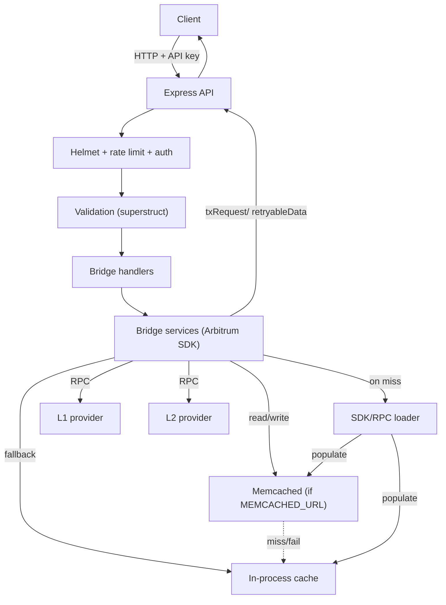

# Arbitrum SDK API

Node.js TypeScript service for generating Arbitrum deposit/withdrawal payloads. Uses Arbitrum SDK + ethers to build tx data for clients.

## Table of Contents

- [Prerequisites](#prerequisites)
- [Getting Started](#getting-started)
  - [Installation](#installation)
  - [Additional Usage](#additional-usage)
- [Environment Variables](#environment-variables)
- [RESTful Endpoints](#restful-endpoints)
  - [Bridge](#bridge)
  - [Health Checks](#health-checks)
- [Developer Notes](#developer-notes)
  - [Application Architecture](#application-architecture)
    - [Middleware Stack](#middleware-stack)
    - [Request Flow](#request-flow)
    - [System Diagram](#system-diagram)

## Prerequisites

1. Node.js: `v22.x`
2. Bun: `1.3.x`
3. RPC provider (Infura/Alchemy) for L1/L2
4. Sepolia ETH for testing

## Getting Started

These steps get you running locally for development and testing.

### Installation

**Before you install:** confirm the [prerequisites](#prerequisites).

1. Clone the repo:
   ```sh
   git clone git@github.com:kevinb1003/arbitrum-task.git
   cd arbitrum-task
   ```
2. Install dependencies:
   ```sh
   bun install
   ```
3. Set up environment variables:
   ```sh
   cp .env.example .env
   ```
   Fill in values (see [Environment Variables](#environment-variables)).
4. Generate Prisma client:
   ```sh
   bun run db:generate
   ```
5. Set up the database (Postgres). Apply migrations:
   ```sh
   bun run db:migrate
   ```
6. Seed the database with an API key (for auth):
   ```sh
   bun run db:seed
   ```
7. Start the server:
   ```sh
   bun run dev
   ```

### Additional Usage

- Build: `bun run build`
- Start (prod): `bun run start`
- Lint: `bun run lint`
- Format check/fix: `bun run format:check` / `bun run format:fix`
- Unit tests: `bun run test`
- Rate limit errors return `code: "RATE_LIMIT_EXCEEDED"` in the JSON body

## Environment Variables

| Name                       | Example                                  | Meaning / Default                          |
| -------------------------- | ---------------------------------------- | ------------------------------------------ |
| PORT                       | 3000                                     | HTTP port                                  |
| NODE_ENV                   | development                              | Node env                                   |
| NETWORK_MODE               | sepolia                                  | `mainnet` or `sepolia`                     |
| L1_RPC_URL                 | https://eth-sepolia.g.alchemy.com/v2/KEY | Parent chain RPC                           |
| L2_RPC_URL                 | https://arb-sepolia.g.alchemy.com/v2/KEY | Child chain RPC                            |
| RATE_LIMIT_WINDOW_MS       | 900000                                   | Rate limit window (ms), default 15 minutes |
| RATE_LIMIT_MAX             | 100                                      | Requests per window                        |
| BRIDGE_GETTER_CACHE_TTL_MS | 300000                                   | Cache TTL for token checks (ms)            |
| BRIDGE_TX_CACHE_TTL_MS     | 15000                                    | Cache TTL for bridge tx payloads (ms)      |
| APPROVAL_CACHE_TTL_MS      | 300000                                   | Cache TTL for approval payloads (ms)       |
| MEMCACHED_URL              | memcached://127.0.0.1:11211              | Optional memcached endpoint                |
| LOG_LEVEL                  | debug                                    | winston log level                          |

## RESTful Endpoints

API authentication is required for all API endpoints. Include header `Authorization: Bearer <API_KEY>`.

### Bridge

<details>
<summary>POST /bridge</summary>

Create a bridge payload. Direction is inferred by `sourceChainId`/`destinationChainId`:

- L1 ➜ L2 (deposit): `sourceChainId` = L1, `destinationChainId` = L2
- L2 ➜ L1 (withdrawal): `sourceChainId` = L2, `destinationChainId` = L1

Body (ETH):

```json
{
  "amount": "1000000000000000000", // wei
  "sender": "0xabc...", // initiator
  "recipient": "0xdef...", // optional; defaults to sender on withdrawal
  "sourceChainId": 11155111, // parent for deposit, child for withdrawal
  "destinationChainId": 421614, // child for deposit, parent for withdrawal
  "tokenAddress": "0x0000000000000000000000000000000000000000" // zero = ETH
}
```

Body (ERC20):

```json
{
  "amount": "5000000000000000000", // wei of the token (check decimals)
  "sender": "0xabc...",
  "recipient": "0xdef...",
  "sourceChainId": 11155111,
  "destinationChainId": 421614,
  "tokenAddress": "0xab1..." // ERC20 address
}
```

Notes:

- `tokenAddress` zero address = ETH; any other address is treated as ERC20.
- For withdrawals, `recipient` defaults to `sender` if omitted.
- Provide `Authorization: Bearer <API_KEY>` if API key auth is enabled.
- Error codes: `INVALID_CHAIN_PAIR`, `TOKEN_DEPOSIT_DISABLED`, `TOKEN_NOT_REGISTERED`, `TOKEN_NOT_APPROVED`, `BRIDGE_REQUEST_FAILED`, `INTERNAL_ERROR`

Responses:

- `200`: payload with `txRequest`, optional `retryableData` (for deposits), `childNetwork`
- `400`: validation errors or unsupported chain pair
- `500`: internal error
</details>

<details>
<summary>POST /bridge/approve/token</summary>

Creates an approval transaction for ERC20 deposits on the parent chain.

Body:

```json
{
  "tokenAddress": "0xab1...",
  "sender": "0xabc...",
  "sourceChainId": 11155111
}
```

Notes:

- Must be called from the parent chain (L1 in default config).
- Returns a `txRequest` with `to`, `data`, `value`.
- Error codes: `INVALID_CHAIN_PAIR`, `BRIDGE_REQUEST_FAILED`, `INTERNAL_ERROR`
</details>

### Health Checks

`GET /` — basic service info.

## Developer Notes

### Application Architecture

- Express server, TypeScript throughout.
- Arbitrum SDK for payload construction, ethers.js for parent/child providers and address utilities.
- Caching layer prefers memcached when configured, falls back to in-process map. Memcached misses/errors fall through silently. If we need persistence, data structures, or clustering, we could plan to swap memcached for Redis, otherwise keep memcached for simple TTL caching.
- For optimization, bridge and approval requests are cached for a short TTL to avoid redundant SDK calls and RPC traffic.

#### Middleware Stack

- Helmet(security headers).
- API key auth.
- Rate limit.
- JSON body parsing.

#### Request Flow

1. Request enters middleware stack (security, rate limit, body parse).
2. Route validation via superstruct.
3. Bridge service builds payload via Arbitrum SDK.
4. Response formatted via `formatApiResponse`.

### System Diagram


